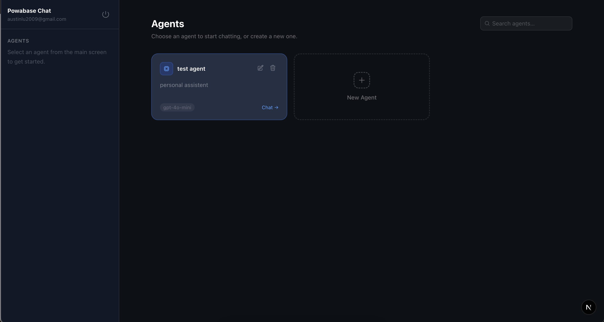
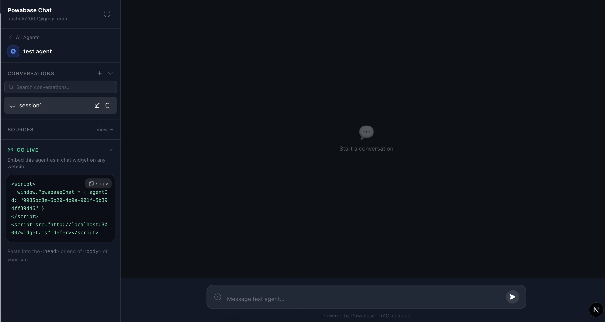

# Powabase Chat App

A full-stack AI chat application built on [Powabase](https://powabase.ai). Users sign up, create AI agents backed by their own knowledge bases, upload documents and websites as sources, and chat with streaming AI responses. Agents can also be embedded as a floating chat widget on any external website with just two lines of HTML - no backend required on the host site.

This app is designed to be a ready-to-deploy foundation. Clone it, point it at your Powabase project, and you have a fully functional multi-user AI chat platform.

## Screenshots


*Agents screen - create and manage multiple AI agents, each with its own knowledge base*


*Chat screen - conversations, sources, and the Go Live embed snippet*

## What it does

**For your users (logged-in accounts):**
- Sign up and log in with email and password
- Create multiple AI agents, each with a custom name and system prompt
- Upload documents or import website URLs into each agent's knowledge base for RAG-powered answers
- Chat with agents in real time with streaming responses and full conversation history
- Attach files or URLs directly in the chat input for one-off context without KB indexing
- Rename, search, and switch between past conversations
- Embed any agent as a widget on an external website via the Go Live section

**For visitors on embedded websites (no account needed):**
- Chat with the embedded agent directly on any website
- Upload files or import URLs as session context
- Conversation history persists in the browser across visits
- Switch between past sessions via a sliding sidebar

## Features

- **Multi-agent workspace** - create and manage multiple AI agents, each with its own system prompt and dedicated knowledge base
- **Knowledge base sources** - upload documents (PDF, DOCX, TXT, CSV, PPTX, XLSX, images) or import URLs into an agent's KB for RAG-powered answers
- **Session-scoped context** - attach files or URLs directly in the chat input; their extracted text is injected inline as context without indexing into the KB
- **Streaming responses** - answers stream token-by-token over SSE in real time with a live typing indicator
- **Conversation history** - sessions persist server-side; users can rename, search, and switch between past conversations
- **Embeddable widget** - two-line HTML snippet generates a floating chat button on any website; no backend required on the host site
- **Widget session sidebar** - visitors can switch between past conversations, rename them, and search - all persisted in `localStorage`
- **Markdown rendering** - assistant responses render rich markdown (headers, lists, code blocks, bold/italic)
- **Cookie-based auth** - `httpOnly` cookies with 30-day rolling expiry; automatic token refresh on every request
- **Session token limit** - enforces a 50,000-token per-session cap with a clear "start a new chat" prompt when reached

## Powabase features used

- **Sources** - upload files and import URLs for text extraction via the Powabase Firecrawl integration
- **Knowledge Bases** - one KB per agent, indexed with `chunk_embed` strategy and hybrid retrieval
- **Agents** - each agent has a custom system prompt and is linked to its own KB
- **Sessions** - Powabase manages server-side conversation history; the app stores only the session ID
- **Streaming (SSE)** - `POST /api/agents/{id}/run/stream` drives real-time token delivery
- **Auth (GoTrue)** - email/password signup and login; tokens verified server-side on every API request
- **PostgREST** - the `session_sources` table stores session-scoped attachment metadata (see Database setup below)

## Architecture

```
Browser
  |
  |- app/page.tsx          Main SPA - agent selection, chat, conversation management
  |- app/login/page.tsx    Sign in / Sign up
  +- app/widget/page.tsx   Iframe chat UI (embedded on external sites)
        |
        v
  Next.js API Routes (server-side, authenticated)
  |- /api/auth/*           Login, signup, logout, me
  |- /api/user/setup       Bootstrap first agent for new users
  |- /api/agents/*         CRUD for agents + KBs
  |- /api/chat             Authenticated SSE streaming proxy - Powabase
  |- /api/sessions/*       List, delete, load history for conversations
  |- /api/sources/*        List, delete, fetch content for KB sources
  |- /api/upload           Upload file - Powabase KB
  |- /api/session-sources  Session-scoped attachments (no KB indexing)
  +- /api/widget/*         Public (no auth) - chat, attach-file, attach-url
        |
        v
  Powabase (AI BaaS)
  |- GoTrue Auth           User identity
  |- Agents + KBs          System prompts, knowledge base search
  |- Sources               File/URL extraction (Firecrawl)
  |- Sessions + Runs       Conversation history
  +- PostgREST             session_sources table
```

## Database setup

This app requires one table in your Powabase project: `session_sources`. It stores the extracted text of files and URLs attached directly in the chat input (session-scoped context that is injected inline rather than indexed into a KB).

Run this SQL in your Powabase project under **SQL Editor**:

```sql
create table if not exists public.session_sources (
  id            uuid primary key default gen_random_uuid(),
  user_id       uuid not null references auth.users(id) on delete cascade,
  session_id    text not null,
  source_id     text not null default '',
  name          text not null,
  type          text not null,
  extracted_text text not null default '',
  created_at    timestamptz not null default now()
);

-- Enable Row Level Security
alter table public.session_sources enable row level security;

-- Users can only read and write their own rows
create policy "Users manage their own session sources"
  on public.session_sources
  for all
  using (auth.uid() = user_id)
  with check (auth.uid() = user_id);
```

**Column reference:**

| Column | Type | Description |
|---|---|---|
| `id` | uuid | Primary key, auto-generated |
| `user_id` | uuid | References `auth.users` - scopes rows to the logged-in user |
| `session_id` | text | The Powabase agent session ID this attachment belongs to |
| `source_id` | text | Internal reference ID for the attachment |
| `name` | text | Display name (filename or URL) |
| `type` | text | `"file"` or `"url"` |
| `extracted_text` | text | Full extracted markdown/text content injected as context |
| `created_at` | timestamptz | When the attachment was added |

RLS ensures each user can only read and write their own rows - no additional auth checks are needed in the API routes.

## Ownership model

No extra tables are needed for agent or source ownership. Ownership is encoded directly in the Powabase object name fields:

- **Agents**: `{userId}__{kbId}__{displayName}` - parsed server-side to filter each user's agents
- **Sources**: `{userId}:{kbIds}:{uuid}:{filename}` - multiple KBs joined with `+` when a source is shared

The `session_sources` table is the only application-specific table in the entire app.

## Session-scoped vs KB-indexed context

There are two ways to give an agent context in this app:

| Method | How | Indexed in KB? | Persists across sessions? |
|---|---|---|---|
| Upload via Sources modal | Drag-drop or URL import | Yes (RAG) | Yes |
| Attach in chat input (`+` button) | File or URL per message | No (injected inline) | For that session only |

Chat-input attachments prepend extracted text to the message as `[Context: File - name]\n...\n\n---\n\n`. This text is stripped when displaying old messages so users only see their original question.

## Embeddable widget

### How to embed

Paste into the `<head>` or end of `<body>` of any website:

```html
<script>
  window.PowabaseChat = { agentId: "YOUR_AGENT_ID" }
</script>
<script src="https://YOUR_APP_URL/widget.js" defer></script>
```

The **Go Live** section in the sidebar generates this snippet automatically for each agent.

### What the widget does

- Injects a floating blue chat button (bottom-right, 68x68px)
- Opens a 390x620px chat panel as an iframe on click
- No authentication required for visitors
- Streams responses in real time with markdown rendering
- Supports file uploads (up to 25 pages) and URL imports as session context
- Sliding sidebar with conversation history, search, and rename - persisted in `localStorage`
- Mobile responsive (full-width below 460px)

### Widget session persistence

Visitor sessions are stored in `localStorage` under `widget_sessions_{agentId}`. Sessions persist until the visitor clears their browser storage or uses incognito mode. Visitors can start a new session at any time via the refresh icon in the widget header.

## Prerequisites

- A [Powabase](https://powabase.ai) project (see Setting up Powabase below)
- The `session_sources` table created (see Database setup above)
- Node 20+ / npm
- An AWS account (for hosting via Amplify)

## Setting up Powabase

If you do not have a Powabase project yet, follow these steps first:

1. Go to [https://powabase.ai](https://powabase.ai) and create an account
2. Click **New Project**, give it a name, and wait for it to finish provisioning
3. Click **Connect** at the top of the page
4. Copy the **Project URL** - this is your `POWABASE_URL`
5. Copy the **Secret key** (the long string starting with `ey`) - this is your `POWABASE_KEY`
6. Go to **SQL Editor** in your Powabase dashboard and run the SQL from the Database setup section above to create the `session_sources` table

Once you have the URL and key, add them to your `.env.local` file (local development) or Amplify environment variables (hosted deployment).

## Local development

1. Clone the repository:
   ```bash
   git clone https://github.com/austinlu1/powabase-app.git
   cd powabase-app
   ```

2. Install dependencies:
   ```bash
   npm install
   ```

3. Create a `.env.local` file in the project root:
   ```env
   POWABASE_URL=https://your-project.powabase.ai
   POWABASE_KEY=your-service-role-key
   ```

   Find these in your Powabase dashboard under **Project Settings -> API**.

4. Start the development server:
   ```bash
   npm run dev
   ```

5. Open [http://localhost:3000](http://localhost:3000) and sign up for an account.

## Hosting on AWS Amplify

### 1. Install the AWS CLI

**Mac (Intel or Apple Silicon):**
```bash
curl "https://awscli.amazonaws.com/AWSCLIV2.pkg" -o "AWSCLIV2.pkg"
sudo installer -pkg AWSCLIV2.pkg -target /
```

**Windows:**

Download and run the MSI installer:
```
https://awscli.amazonaws.com/AWSCLIV2.msi
```

After installing, close and reopen your terminal. If `aws` is still not recognized, open **Start -> Search "Environment Variables" -> Edit the system environment variables -> Environment Variables -> System variables -> Path -> Edit** and add `C:\Program Files\Amazon\AWSCLIV2\` if it is not already there.

**Linux:**
```bash
curl "https://awscli.amazonaws.com/awscli-exe-linux-x86_64.zip" -o "awscliv2.zip"
unzip awscliv2.zip
sudo ./aws/install
```

Verify the installation on any OS:
```bash
aws --version
```

You should see something like `aws-cli/2.x.x`.

### 2. Configure the AWS CLI

Run:
```bash
aws configure
```

You will be prompted for:
- **AWS Access Key ID** - from your AWS console under Security credentials -> Access keys -> Create access key
- **AWS Secret Access Key** - shown once when you create the access key
- **Default region name** - enter `us-east-1`
- **Default output format** - enter `json`

Verify it is connected:
```bash
aws sts get-caller-identity
```

You should see your account ID returned.

### 3. Connect your repository

1. Go to [https://console.aws.amazon.com/amplify](https://console.aws.amazon.com/amplify)
2. Click **Create new app** and select **GitHub**
3. Authorize AWS and select the `powabase-app` repository and the `main` branch
4. Leave the auto-detected build settings and click **Save and deploy**

### 4. Add environment variables

In Amplify, go to **Environment variables** in the left sidebar and add:

| Variable | Value |
|---|---|
| `POWABASE_URL` | Your Powabase project URL (no trailing slash) |
| `POWABASE_KEY` | Your Powabase service role key (the secret key starting with `ey`) |

Then go to **Deployments** and click **Redeploy this version**.

### 5. Done

Your app is live at the Amplify URL (e.g. `https://main.xxxx.amplifyapp.com`). Update your widget embed snippet to use this URL.

## Environment variables

| Variable | Required | Description |
|---|---|---|
| `POWABASE_URL` | Yes | Base URL of your Powabase project |
| `POWABASE_KEY` | Yes | Service role key (server-side only, never exposed to the browser) |

## Project structure

```
app/
|- api/
|   |- auth/              Login, signup, logout, me
|   |- user/setup         Bootstrap new users
|   |- agents/            Agent + KB CRUD
|   |- chat/              Authenticated SSE chat proxy
|   |- sessions/          Conversation list and history
|   |- sources/           KB source management
|   |- upload/            File upload to KB
|   |- session-sources/   Session-scoped attachments
|   +- widget/            Public chat, attach-file, attach-url
|- login/                 Sign in / sign up page
|- widget/                Iframe chat UI
+- page.tsx               Main SPA

components/
|- AgentsScreen.tsx       Agent card grid with create/edit/delete/search
|- Sidebar.tsx            Conversation list, search, rename, Go Live section
|- ChatArea.tsx           Message history with markdown rendering
|- MessageInput.tsx       Input bar with file/URL attachment
+- SourcesModal.tsx       KB source management modal

lib/
|- powabase-server.ts     Server-only Powabase helpers + auth
+- types.ts               TypeScript interfaces

public/
+- widget.js              Self-contained embeddable widget script
```

## Notable design decisions

- **No middleware for auth** - authentication is enforced per API route via `getUserFromCookie`. The client redirects to `/login?reason=session_expired` when `/api/user/setup` returns 401.
- **Rolling cookie expiry** - on every authenticated request, both cookies are re-set to extend the 30-day expiry, so active users are never logged out unexpectedly.
- **Ownership without extra tables** - agent and source ownership is encoded in Powabase name fields rather than a separate database table, keeping the schema minimal.
- **25-page file limit** - files exceeding 25 pages are rejected after extraction to keep context sizes manageable.
- **50,000-token session limit** - estimated at 4 chars/token across all runs in a session. When reached, a banner prompts the user to start a new chat.

## Powered by

- [Powabase](https://powabase.ai) - AI BaaS (agents, knowledge bases, sources, auth, sessions)
- [Next.js](https://nextjs.org) - React framework
- [Tailwind CSS](https://tailwindcss.com) - styling
- [AWS Amplify](https://aws.amazon.com/amplify/) - hosting
